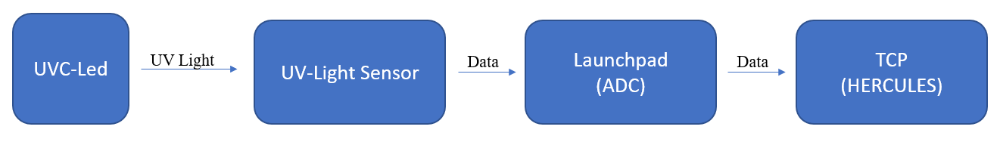
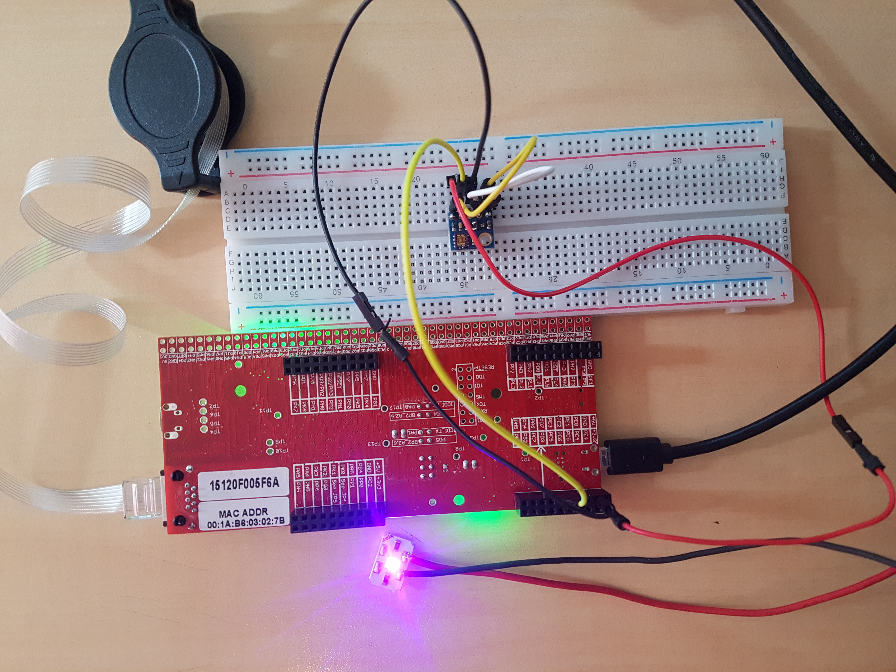

# EMBEDDED SYSTEMS PROJECT / Safe Disinfecting Device (ML5811 UV Light Intensity with TM4C1294NCPDT)

## About

- This project is about  measuring the UV light intensity using [ML8511 sensor](https://cdn.sparkfun.com/datasheets/Sensors/LightImaging/ML8511_3-8-13.pdf "ML8511") and [Texas Instrument's TM4C1294NCPDT ](https://www.ti.com/product/TM4C1294NCPDT "TEXAS INSTRUMENTS") board.

- If the light intensity is below a predetermined level, it writes a log to the Internet server indicating the predetermined intensity level and the measured value with time. 

- In this project;

  - Tasks

  - Timers

  - Semaphores

  - Mailboxes

  - Network Time Protocol

  - TCP / IP 

    are used.
    
  

## Photo

  

------------------------------------------

### This project has been created within the scope of Embedded Systems Design (EEM449) course at Eskişehir Technical University.
